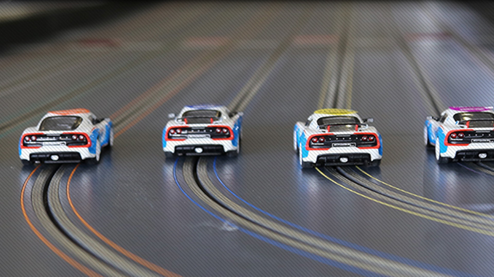

# Assignment #8: Week 44

## Software Engineering

### Exercise 1
Decomposing a system into subsystems reduces the complexity developers have to deal with by simplifying the parts and increasing their coherence. Decomposing a system into simpler parts usually results into increasing a different kind of complexity: Simpler parts also means a larger number of parts and interfaces. If coherence is the guiding principle driving developers to decompose a system into small parts, which competing principle drives them to keep the total number of parts small?

### Exercise 2
Consider an existing game of bridge written in Java. We are interested in integrating this bridge game into ARENA. Which design pattern would you use? Draw a UML class diagram relating the ARENA objects with some of the classes you would expect to find in the bridge game.

### Exercise 3
Consider a system that includes a database client and two redundant database servers. Both database servers are identical: the first acts as a main server, the second acts as a hot back-up in case the main server fails. The database client accesses the severs through a single component called a “gateway,” hence hiding from the client which server is currently being used. A separate policy object called a “watchdog” monitors the requests and responses of the main server and, depending on the responses, tells the gateway whether to switch over to the back-up server. What do you call this design pattern? Draw a UML class diagram to justify your choice.

## C&#35;

Fork this repository and implement the code required for the assignments below.

### Slot Car Tournament part cinq

Implement and test a master-detail Xamarin.Forms *or* UWP app.

The app should display a list/grid of cars on the main page.
Tapping a car should go to a car page with more details including the image of the car.
A back button should be implemented to allow the user to go back and forth between master and detail views.

Cars should be loaded from the supplied web API for example:

- /api/cars
- /api/cars/1
- /api/cars/1/image

Use should strive to use MVVM as much as possible to limit the code in the code-behind files
and be able to test as much as possible.

Implementation should use an IoC container to load the view model and dependencies.

We understand that this is a big task so it's up to you to choose which parts you want to implement and subsequently get feedback from from your peers.

Note:

To seed the database with a few cars and images you first need to configure your user secrets for the web project with a connection string.
Then run these commands:

PM> Add-Migration InitialMigration -Project BDSA2018.Assignment08.Entities
PM> Update-Database
